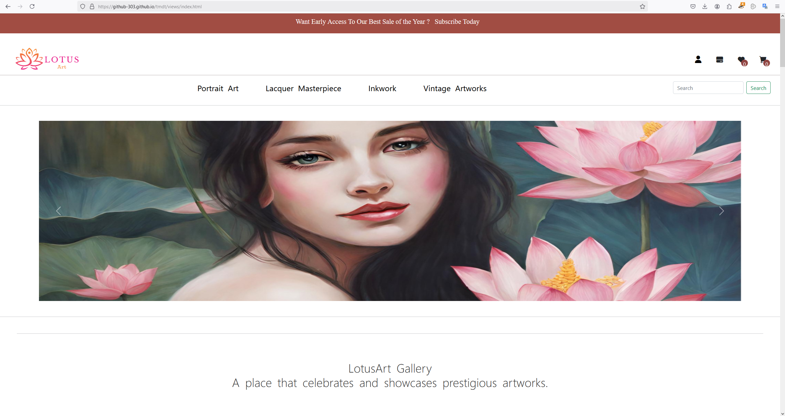

# Lotus Art - Website Thương Mại Điện Tử Nghệ Thuật

Website thương mại điện tử chuyên về bán tranh nghệ thuật và các tác phẩm nghệ thuật. Nền tảng cung cấp nhiều danh mục nghệ thuật khác nhau bao gồm Tranh Chân Dung, Tranh Sơn Mài, Tranh Mực và Tranh Cổ.

## Demo Trực Tuyến
https://github-303.github.io/tmdt/views/index.html


## Tính Năng

### Tính Năng Người Dùng
- Duyệt qua các danh mục nghệ thuật
- Xem chi tiết sản phẩm với mô tả đầy đủ
- Chức năng giỏ hàng
- Hệ thống xác thực người dùng
- Thiết kế responsive cho mọi thiết bị
- Hỗ trợ hai ngôn ngữ (Tiếng Anh và Tiếng Việt)
- Hệ thống thanh toán với thu thập thông tin người dùng

### Tính Năng Admin
- Hệ thống quản lý sản phẩm
- Quản lý đơn hàng
- Quản lý người dùng

### Tính Năng Thiết Kế
- Grid Layout cho trang chủ và trang danh mục
- One-Column Layout (Responsive) cho chi tiết sản phẩm
- Thiết kế banner toàn màn hình
- Header với menu điều hướng
- Footer với các liên kết và thông tin quan trọng
- Các thành phần UI tương tác với hiệu ứng hover

## Công Nghệ Sử Dụng

### Frontend
- HTML5
- CSS3 (Framework Bootstrap)
- JavaScript
- jQuery
- Thao tác DOM
- Local Storage để lưu trữ dữ liệu

### Công Cụ Thiết Kế
- Figma cho thiết kế layout
- Canva AI cho tạo hình ảnh

### SEO
- Tối ưu hóa thẻ meta
- Thiết kế tương thích mobile
- Hỗ trợ đa ngôn ngữ

## Thông Tin Đăng Nhập

### Tài Khoản Người Dùng
- Tài khoản: user
- Email: user@user.com
- Mật khẩu: user

### Tài Khoản Admin
- Tài khoản: admin
- Email: admin@admin.com
- Mật khẩu: admin

## Cài Đặt và Chạy Dự Án

1. Tải xuống hoặc clone repository
2. Di chuyển vào thư mục dự án
3. Mở file index.html trong trình duyệt web

## Cấu Trúc Dự Án
```
project/
│
├── views/
│   ├── index.html
│   └── [các file view khác]
│
├── css/
│   ├── bootstrap.css
│   └── custom styles
│
├── js/
│   ├── jquery-3.6.4.js
│   └── custom scripts
│
└── assets/
    └── images/
```

## Kế Hoạch Phát Triển Tương Lai

1. Tích Hợp Cơ Sở Dữ Liệu
   - Triển khai MongoDB
   - Thiết kế cấu trúc dữ liệu phù hợp

2. Phát Triển Backend
   - Tích hợp backend Node.js/Python
   - Phát triển API sử dụng Express.js/Flask/Django

3. Tích Hợp Thanh Toán
   - Tích hợp với cổng thanh toán
   - Xử lý giao dịch an toàn

4. Tính Năng Nâng Cao
   - Chức năng tìm kiếm nâng cao
   - Đánh giá và nhận xét của người dùng
   - Tính năng danh sách yêu thích
   - Theo dõi đơn hàng
